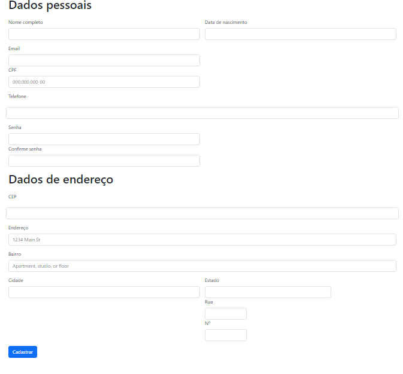

# Introdução
 Na aula passada, fizemos uma atividade proposta pelo professor aonde deveríamos simular um cadastro em sites de E-commerce e documentar em um formulário os campos que encontramos e as diferenças que vimos entre eles.

# Sites pesquisados
1º Site: CB skate shop  
2º Site: skate dos sonho  
3º Site: shoppe  

# Campos encontrados
## CB skate shop
* Nome
* sobrenome 
* CPF 
* telefone 
* e-mail 
* senha 
* confirmação de senha 
* Estado 
* cidade 
* rua  
* número da casa.

## Skate dos sonho
* Nome completo 
* data de nascimento 
* telefone 
* e-mail 
* senha 
* CEP 
* número da casa e complemento (opcional)
## shoppe
* Nome Completo 
* número de telefone 
* Cep 
* CPF
 * Estado 
* Cidade 
* Bairro 
* Rua / Avenida 
* número da moradia 
* (complemento/Referências/Descrição do Prédio).  

# Diferenças encontradas
Alguns dos sites possuem a necessidade de escrever duas vezes o e-mail ou a senha, isso é um meio de segurança que evita que o cliente digite errado algum desses dois campos de registro. Alguns sites pedem o endereço inteiro, já outros apenas o CEP, o número da casa ou complemento, isso faz com que o site já saiba onde você deseja receber esse produto sem precisar digitar cidade, estado, bairro e rua.

# Campos que vão ser usados no meu formulário
* nome completo 
* CPF 
* CEP 
* e-mail 
* senha 
* telefone 
* número da casa 
* complemento (opcional)
* Rua
* Cidade
* Estado
* Bairro

# Formulário construído
